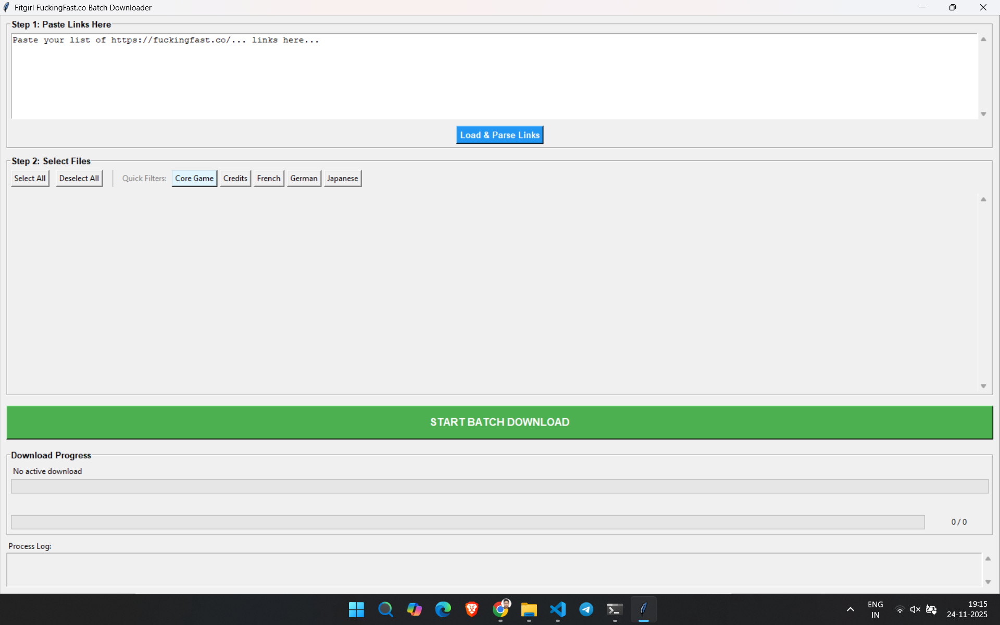
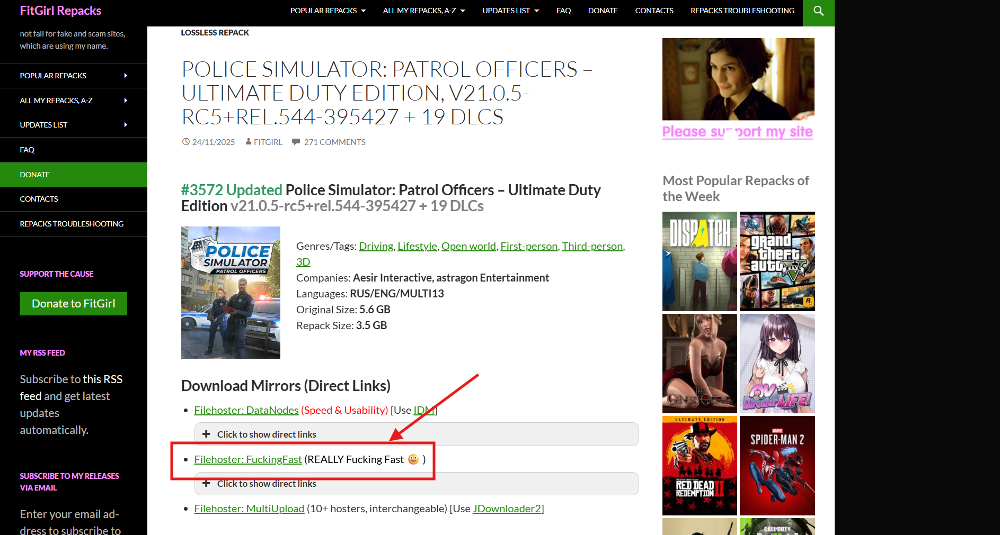
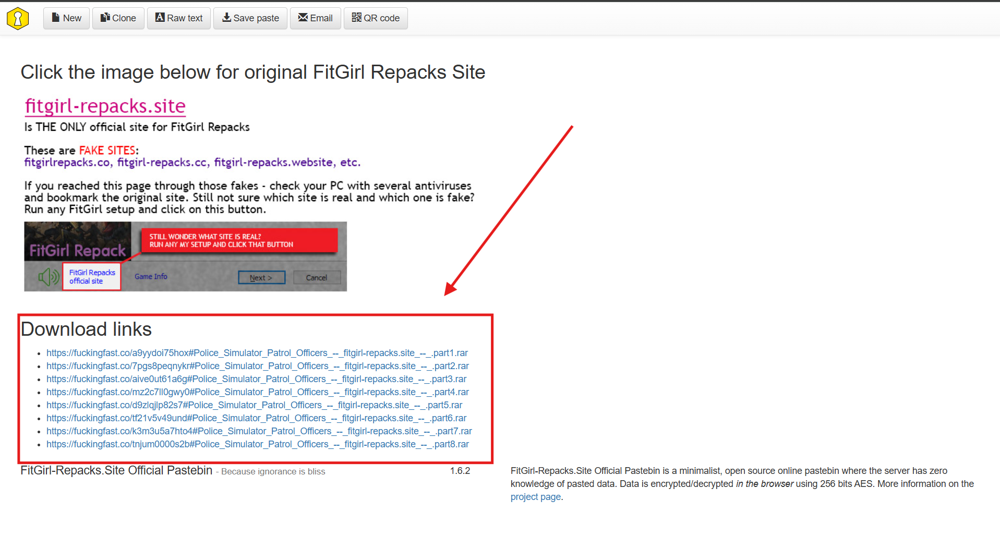
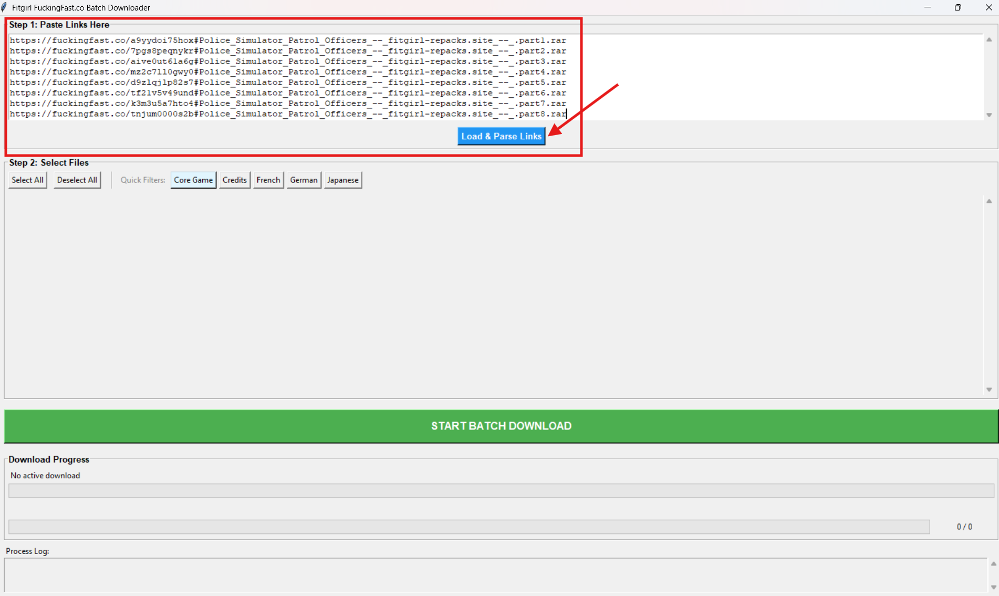
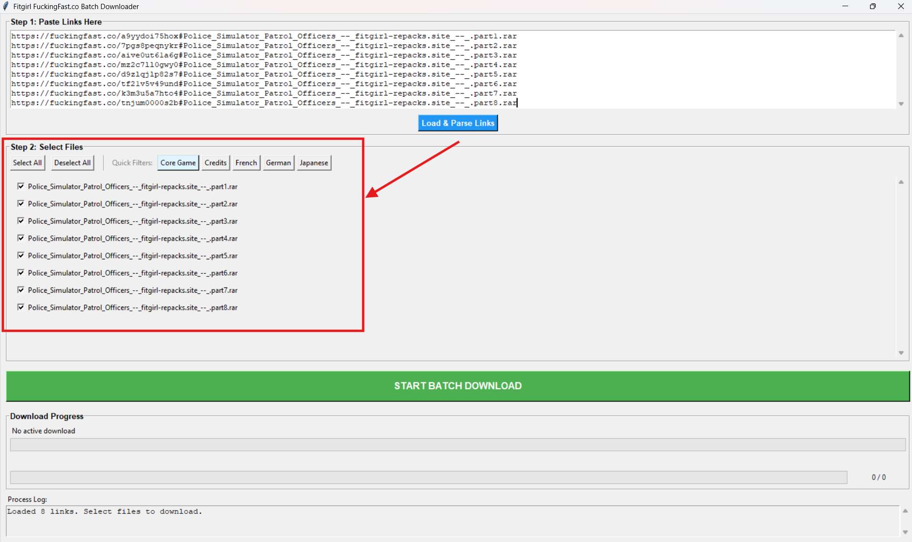
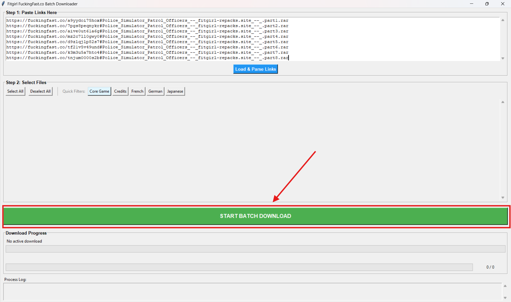

# **FitGirl Multipart Downloader – Automated Installer for FitGirl Repacks**

FitGirl Multipart Downloader is a Windows desktop tool that automates the downloading of **multipart archives** (e.g., `bin`, `bin1`, `bin2`, `.rar`, etc.) from **FitGirl-Repacks.site**.
Instead of manually clicking every part on mirror sites, the tool uses **Selenium** to automatically open download pages, solve delays, and fetch files with a clean Tkinter GUI.

This eliminates repetitive clicking and speeds up the overall downloading workflow.

---

## **📌 Key Features**

### ✔ **Automated Multi-Part Downloading**

- Automatically visits all download mirrors for a FitGirl Repack.
- Grabs all links for `.bin`, `.rar`, `.zip`, or other multipart files.
- Initiates downloads without user interaction.

### ✔ **GUI (Tkinter)**

- Start, stop, and monitor downloads easily.
- Real-time logs in a scrollable window.
- Optional **per-file progress bar**.

### ✔ **Selenium + Chrome**

- Handles waits, pop-ups, countdown timers, and navigation.
- Mimics real user interaction.

### ✔ **Multithreaded**

- UI stays responsive while downloads run in the background.

### ✔ **Safe & Non-Intrusive**

- Does NOT bypass FitGirl rules.
- Only automates clicking the existing download mirrors.

---

## **📂 Project Structure**

```
FitGirlDownloader/
│
├── main.py               # Main Tkinter + Selenium downloader logic
├── run.bat            # Launch script for Windows
├── requirements.txt      # Dependencies
└── README.md             # Documentation (this file)
```

---

## **▶️ Setup Instructions**

### **1. Install Dependencies**

If using **UV**:

```bash
uv sync
```

or with pip:

```bash
pip install -r requirements.txt
```

---

### **2. Run the Downloader**

You may run it using:

```bash
uv run main.py
```

or double-click the included:

```
run_uv.bat
```

---

## **🧾 Windows Run Script Explanation**

```bat
@echo off
cd /d "%~dp0"
uv run main.py
pause
```

**What this does:**

- Ensures the script runs in its own directory
- Executes your Python script using UV
- Keeps the window open for debugging

---

# **📘 Operating Procedure**

This section explains how to operate the **FitGirl Multipart Downloader**, including step-by-step instructions and sample screenshots.

---

## **1️⃣ Launching the Application**

### **Method A – Using the Windows Script**

Double-click:

```
run_uv.bat
```

This will open the application.



---

### **Method B – Running via UV**

```bash
uv run main.py
```

---

## **2️⃣ Entering the FitGirl Repack URL**

1. Go to: **[https://fitgirl-repacks.site/](https://fitgirl-repacks.site/)**

2. Open any game page.

3. Click **Filehoster: FuckingFast**

   

4. Copy all part Links

   

5. Paste it into the URL input box in the app and Click Load.

   

---

## **3️⃣ Starting the Download Process**

1. Select all needed parts.



2. Click the **Start Download** button.



---

## **4️⃣ Real-Time Logs**

As the process runs, logs will appear in the scrolling text window.

You will see messages such as:

- “Opening download page…”
- “Waiting for countdown…”
- “Download button clicked”
- “File 1/12 started downloading”
- “Finished downloading part #3”

## **5️⃣ Per-File Progress Bar**

- A progress bar will appear under the log window
- It updates during each file download
- Shows partial progress for `.bin`, `.rar`, `.zip` files

# **⚠️ Important Notes**

- Captchas (if present) must be solved manually — the tool cannot bypass them.
- Some mirrors block automation; in such cases the tool skips to the next one.
- Do NOT close the Chrome window during download.
- Make sure ChromeDriver matches your Chrome version.

---

## **⚙️ Supported Download Types**

FitGirl multipart files including:

| Type   | Example              |
| ------ | -------------------- |
| `.bin` | bin, bin1, bin2…     |
| `.rar` | part1.rar, part2.rar |
| `.zip` | zip archives         |
| `.iso` | where provided       |
| `.exe` | small installers     |

---

## **🛠 Requirements**

- Python 3.10+
- Selenium
- Chrome + matching ChromeDriver
- Tkinter (usually comes with Python)
- UV (optional but recommended)

---

## **🧩 Known Limitations**

- Some mirrors aggressively use anti-bot protections.
- Captchas must be solved manually (no bypass included).
- Download speed depends on mirror hosting.

---

## **🚀 Future Improvements**

- Automatic retry if a mirror fails
- Per-file download speed and ETA
- Option to auto-skip slow mirrors
- Selective file downloading
- Headless/browserless mode
- Group downloads by game title

---

## **📄 License**

This tool is intended for personal use **only**.
Do not misuse it or violate the terms of FitGirl mirrors.
